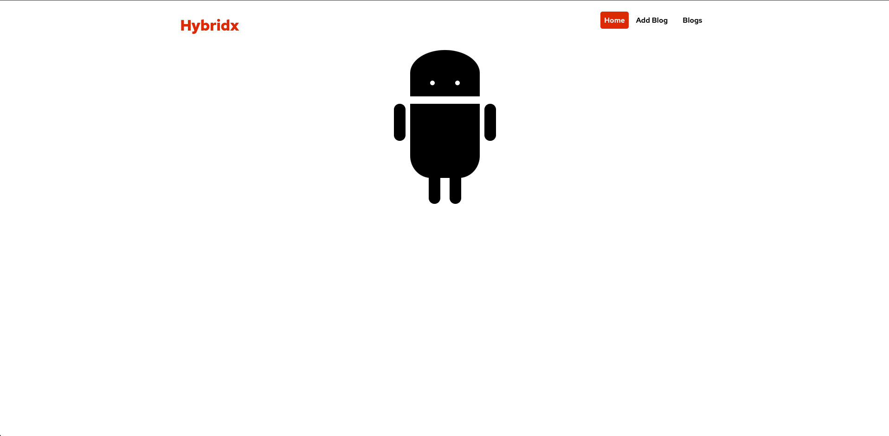
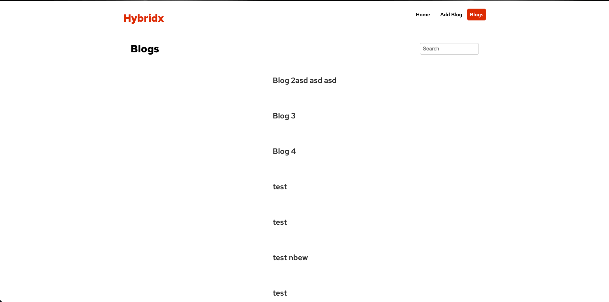
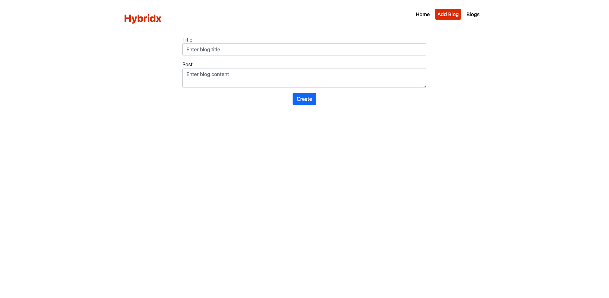
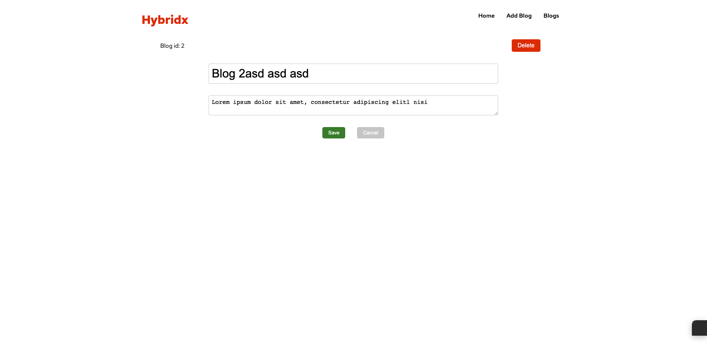
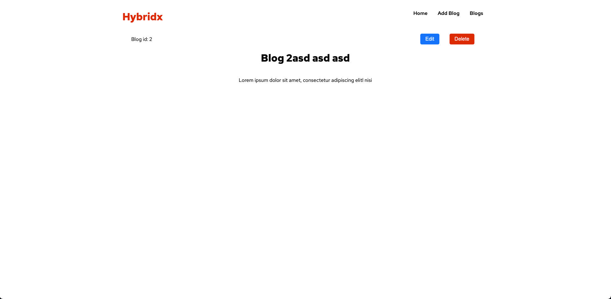

# Welcome to Vue-blog

### A project create to learn the basics of vue

### Here are some screenshots







## Project setup
```
npm install
```

### Compiles and hot-reloads for development
```
npm run watch:json-server
npm start
```

### Compiles and minifies for production
```
npm run build
```

### Customize configuration
See [Configuration Reference](https://cli.vuejs.org/config/).
